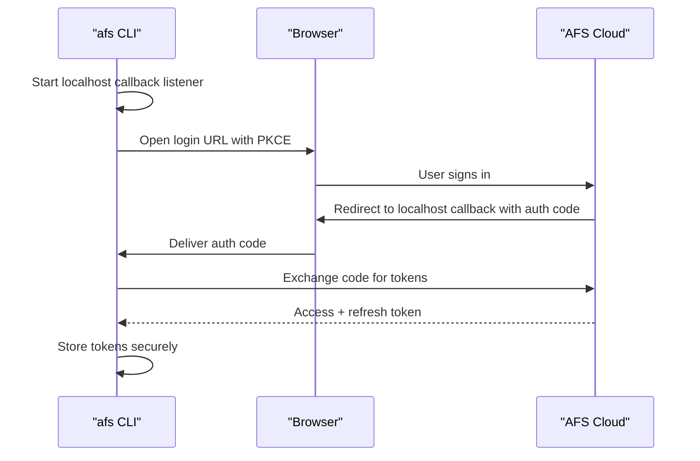
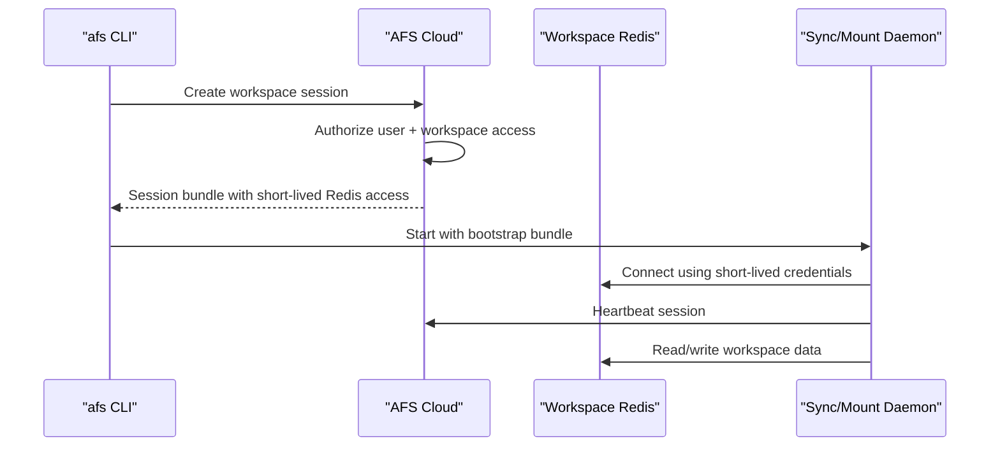

# AFS Cloud Control Plane Design

Date: 2026-04-13
Status: In progress

## Purpose

Define a concrete architecture and rollout plan for a hosted AFS product where:

- users visit a website, sign in, and create workspaces
- the website can provision and manage backing databases for them
- users can optionally attach their own databases instead
- local `afs` clients can connect in a cloud-managed mode
- existing standalone/local AFS behavior remains intact

This document is intentionally implementation-adjacent. It is meant to guide a
step-by-step transition where each phase is small enough to build, test, and
stabilize before moving on.

## Design Principles

1. Standalone AFS stays first-class.
2. Cloud mode must not require long-lived Redis credentials in the CLI config.
3. Cloud mode should feel like one product even if the data plane still uses Redis directly.
4. Browser login for humans should feel like Claude Code:
   the CLI opens a browser, the user signs in, and the CLI comes back authenticated.
5. Redis Cloud integration auth is a separate concern from AFS user auth.
6. We should prefer a sequence of reversible changes over one large rewrite.
7. Product modes must be explicit at bootstrap time, not inferred ad hoc deep in handlers.
8. Browser/admin surfaces and client/session surfaces should be separately secured even if they share one binary in development.
9. Presence and activity are different products; we should not derive active clients from activity logs.
10. All server-side external credentials should live behind a secret-store abstraction from day one.

## Lessons From `cloud-context-engine`

The `~/git/cloud-context-engine` reference reinforces a few architecture choices that are especially relevant for AFS Cloud:

- mode should change bootstrap behavior, route exposure, secret-store defaults, and operational requirements
- browser-oriented control-plane routes and agent/client routes should be treated as distinct security surfaces
- browser session handling and CLI login should share one identity system, but they do not need to share one transport mechanism
- signed tokens should be validated locally by services using JWKS or equivalent cached verifier state
- downstream Redis and provider credentials should be stored via a dedicated secret-store layer, not ad hoc config fields
- session activity logs are useful, but connected-client presence should come from heartbeat leases

## Current State

AFS already has useful building blocks:

- a local HTTP control plane with database-scoped routes
- a workspace/checkpoint/blob data model in Redis
- a browser UI under `ui/`
- local sync and mount flows that operate against a live Redis-backed workspace root

Important current constraints:

- the CLI runtime still assumes it can connect directly to Redis for `up`, sync, and mount
- the hosted HTTP control plane is browse-oriented today, not yet the full remote execution path
- there is no user auth, no browser login flow, and no secure profile/token storage
- there is no durable concept of active connected clients
- the browser-facing surface and the local-client/session surface are not yet clearly separated

## Implementation Status

This section reflects the repository as it exists today.

### Completed so far

- explicit runtime modes now exist in the CLI config and bootstrap path:
  `local`, `self-hosted`, and `cloud`
- the legacy `direct` name is still accepted as an alias for `local`
- the CLI now has a backend boundary instead of assuming one direct Redis path everywhere
- `local` mode continues to use the direct Redis-backed runtime path
- `self-hosted` mode now has an HTTP control-plane client and backend
- the control plane now exposes separate admin and client route surfaces
- workspace and checkpoint control-plane operations now work over HTTP in `self-hosted` mode
- `afs up` and `afs down` now work in `self-hosted` mode for `sync`
- `afs up` in `self-hosted` mode now asks the control plane for a workspace bootstrap/session bundle, then starts the local sync daemon from that bundle
- setup and status now expose the local-vs-managed model more clearly

### Partially completed

- route-surface split exists, but there is still no auth boundary between them
- workspace session bootstrap exists, but it is still only a startup/bootstrap mechanism
- `self-hosted` `afs up` works only for `sync`; mount mode is still local-only
- `afs down` still performs only local teardown; it does not yet notify the control plane
- there is still no session registry, heartbeat, disconnect event, or connected-clients reporting
- the web UI is control-plane-backed, but it does not yet expose the new client/session lifecycle or all newly added control-plane features

### Not started yet

- browser login and CLI login for AFS Cloud (`afs auth login/logout/status`)
- secure token storage and profile management
- connected-clients presence and activity reporting
- secret-store support for provider credentials
- Redis Cloud managed provisioning flow
- real `cloud` runtime mode (`cloud` remains intentionally unimplemented)

## Product Modes

AFS should support three explicit modes:

These are not just user-facing labels.

They should drive:

- bootstrap wiring
- auth expectations
- route exposure
- secret-store requirements
- operational checks and defaults

### `local`

Today's behavior.

- local config points at Redis directly
- local sync and mount keep working unchanged
- no hosted control plane required
- `direct` remains accepted as a legacy config alias

### `self-hosted`

Private deployment of the AFS API.

- CLI talks to an HTTP control plane
- the control plane manages workspace metadata and session bootstrap
- the actual data plane may still be one or more Redis instances owned by that deployment

### `cloud`

Hosted AFS product.

- users authenticate to AFS Cloud via browser login
- the website owns workspace lifecycle and policy
- the cloud service provisions managed databases or connects to user-supplied ones
- local `afs` clients receive cloud-issued session bundles for workspace access

## Target Architecture

At a high level, AFS Cloud should split into control plane and data plane.

### Control plane surfaces

The control plane should expose at least two logical surfaces:

- browser/admin surface
  - website auth
  - workspace and database CRUD
  - connection instructions
  - connected-clients UI
- client/session surface
  - workspace session issuance
  - session renewal
  - heartbeat
  - disconnect
  - narrow read APIs needed by local daemons

In local development these may be served by one process.

In production we should preserve the option to split them into separate deployments or at least separate middleware stacks.

### Control plane responsibilities

- account and organization management
- browser login and API token issuance
- workspace CRUD
- database binding CRUD
- managed database provisioning jobs
- external database validation jobs
- workspace connection instructions
- client session issuance, heartbeat tracking, and presence
- activity and audit aggregation

### Data plane responsibilities

- Redis-backed storage for workspace metadata, manifests, blobs, checkpoints, and live roots
- per-workspace mutation streams
- per-workspace session and presence keys

### Local client responsibilities

- authenticate to AFS Cloud
- ask the control plane for a workspace session
- start sync or mount using a short-lived session bundle
- heartbeat while active
- report disconnect on shutdown when possible

### Browser responsibilities

- sign in users
- create and manage workspaces
- show connection instructions for local `afs`
- configure managed or external databases
- show connected clients and recent activity

## Core Decision: Cloud Mode Still Uses Redis As The Data Plane

For the first cloud-connected version, the local runtime should still talk to Redis for live filesystem operations.

What changes is who mints the Redis access:

- in `direct` mode, the CLI uses locally configured Redis credentials
- in `cloud` mode, the CLI asks the control plane for a short-lived workspace session bundle

That session bundle contains only the minimum needed to operate on one workspace for a limited time.

This lets us keep the current sync and mount engines while still making cloud mode centrally managed.

## Authentication

There are three separate auth problems.

We should treat them separately from the start.

### 1. Human auth to AFS Cloud

This is the login experience for the AFS website and for `afs auth login`.

Recommended design:

- website uses a normal browser session on the AFS web origin
- CLI uses OAuth 2.1 / Authorization Code with PKCE
- CLI launches the system browser
- CLI starts a localhost callback listener
- user signs in on the web
- control plane redirects back to the CLI callback
- CLI exchanges the code for tokens and stores them securely
- control-plane services validate signed access tokens locally using JWKS or equivalent cached verifier state

Why this shape:

- matches the UX you want from Claude Code
- works well for both native apps and a browser-first product
- avoids teaching users about API keys for basic interactive use
- keeps browser session handling and CLI auth flow decoupled while still sharing one identity system

Notes:

- the website may use a gateway or same-origin session layer for browser cookies
- that browser-session mechanism should stay a web concern, not the CLI transport
- the CLI should remain PKCE-based even if the website uses cookie-backed sessions internally

CLI commands:

- `afs auth login`
- `afs auth logout`
- `afs auth status`

Local storage:

- config file stores profile metadata only
- tokens go into keychain/keyring with encrypted-file fallback

### 2. Local client auth to a workspace

This is how a logged-in CLI gets permission to operate on a workspace.

Recommended design:

- CLI calls `POST /v1/workspaces/{workspace_id}/sessions`
- control plane authorizes the user and creates a workspace session
- response includes:
  - `session_id`
  - workspace metadata
  - local mode hints
  - Redis endpoint
  - short-lived Redis username/password or token
  - TLS requirements
  - expiry timestamp
  - heartbeat interval
  - capability flags

The child sync or mount daemon should use this bundle directly.

The bundle should be:

- scoped to one workspace
- short-lived
- renewable via the control plane
- invalidatable by the control plane

This is the main security boundary for cloud mode.

The daemon-facing session routes should stay narrow and separate from browser/admin concerns.

They should not depend on browser cookies.

### 3. AFS Cloud auth to Redis Cloud APIs

This is only for managed provisioning and account linking inside the website.

This is not the same as AFS user login.

Recommended v1:

- support user-provided Redis Cloud API key + secret in the AFS web UI
- validate them server-side
- store them encrypted server-side
- use them for Redis Cloud API calls from the control plane

Recommended later:

- optional assisted Redis Cloud linking flow if we decide the product value justifies it

## Secret Storage Model

Before we add managed databases or BYO database support, we should introduce a dedicated secret-store abstraction in the control plane.

Responsibilities:

- store Redis Cloud API credentials
- store external database credentials
- store managed database connection credentials when they must persist server-side
- support health checks and startup validation
- support encryption-key rotation

Recommended interface shape:

- `WriteSecret(scope, secret_id, payload)`
- `ReadSecret(scope, secret_id)`
- `DeleteSecret(scope, secret_id)`
- `HealthCheck()`

Recommended implementations:

- development: in-memory secret store for local iteration only
- first real deployment: encrypted Redis-backed secret store or cloud KMS-backed store
- later / enterprise: pluggable Vault or managed secret-store integration

Scoping:

- secrets should be keyed by organization or account plus binding id
- avoid hiding this relationship in unrelated object ids
- workspace records should reference bindings; bindings should reference secret ids

Non-goals:

- CLI never stores provider credentials
- provider credentials should not live in plain config or ordinary workspace metadata

## Redis Cloud Integration Strategy

There are two realistic ways to connect AFS Cloud to Redis Cloud.

### Option A: User enters Redis Cloud API credentials

Flow:

1. User opens a "Connect Redis Cloud" screen in AFS Cloud.
2. User pastes Redis Cloud API key and secret.
3. AFS Cloud validates the credentials.
4. AFS Cloud stores them encrypted.
5. AFS Cloud uses them for provisioning and discovery jobs.

Pros:

- straightforward
- explicit
- works for automation and background jobs
- easy to reason about operationally

Cons:

- worse UX than browser-based account linking
- requires key management by the user

### Option B: Browser-assisted Redis Cloud linking

Radar shows an example of this style:

- server-side use of Redis Cloud `JSESSIONID` plus CSRF to identify the user
- browser-side calls to Redis Cloud APIs using that session context
- account switching and API key creation inside the Redis Cloud session

This is much more complicated.

Why it is complicated:

- it depends on Redis Cloud session cookies and CSRF behavior
- it requires careful cross-site cookie handling
- it introduces account-context switching semantics
- it is not naturally usable by background jobs unless we convert the linked session into stable API credentials
- session lifetime and failure modes are harder to explain

Recommendation:

- do not make this the first Redis Cloud integration path for AFS Cloud
- first ship API-key-based Redis Cloud integration
- only explore browser-assisted linking after the rest of AFS Cloud is stable

### Notes from Radar

The `~/git/radar` reference confirms that Redis Cloud browser-assisted linking is possible, but it also shows why it should not be our first dependency.

Observed patterns in Radar:

- server-side Redis Cloud identity lookup uses `JSESSIONID` plus a CSRF fetch before calling `users/me`
- browser-side Redis Cloud API interactions rely on the existing Redis Cloud web session and CSRF token
- creating Redis Cloud API keys may require current-account switching before the API call
- durable Redis Cloud API credentials are stored server-side after capture

What this means for AFS:

- browser-assisted linking is viable as a later enhancement
- it still does not remove the need for durable server-side credentials for background provisioning jobs
- it introduces more moving parts than the rest of the cloud runtime needs in order to launch

So the right first move is:

- AFS browser login for AFS itself
- Redis Cloud API key + secret for Redis Cloud integration
- optional assisted linking only after the base cloud product is working

## Database Model

The database model should distinguish between:

- managed databases
- external databases

### Managed database

Created and owned through AFS Cloud.

Fields:

- `database_id`
- `provider = redis-cloud`
- `management_mode = managed`
- account or subscription reference
- region
- plan / capacity / policy metadata
- connection state

User experience:

- user clicks "Create workspace"
- chooses region and maybe size/profile
- AFS Cloud provisions Redis
- workspace becomes ready when the database and namespace are ready

### External database

User attaches their own Redis deployment.

Fields:

- `database_id`
- `provider = external`
- `management_mode = external`
- display name
- connection metadata
- TLS mode
- validation state
- optional ownership tags

User experience:

- user clicks "Use my own database"
- provides connection details
- AFS Cloud validates connectivity and compatibility
- user creates workspaces against that database

### Recommended starting point

For the first managed rollout:

- one managed Redis database per workspace is simplest

Longer-term optimization:

- support shared managed databases with per-workspace namespace isolation

The first path costs more, but it dramatically reduces blast radius and complexity.

## Workspace Session And Presence Model

AFS currently has audit events and a mutation stream, but not a real active-client model.

Cloud mode should add a first-class session registry.

Presence and activity should be modeled separately:

- presence answers "who is connected right now?"
- activity answers "what happened?"

We should not infer active clients from mutation logs or audit feeds, because quiet but healthy clients would disappear.

### Session record

Each client session should have:

- `session_id`
- `workspace_id`
- `organization_id`
- `user_id`
- `client_kind`
  - `sync`
  - `mount`
  - `cli`
  - `mcp`
- `afs_version`
- `hostname`
- `os`
- `started_at`
- `last_seen_at`
- `lease_expires_at`
- `state`
  - `starting`
  - `active`
  - `idle`
  - `stale`
  - `closed`
- `local_path`
- `readonly`
- `last_error`
- counters:
  - `uploads`
  - `downloads`
  - `checkpoint_count`
  - `mutations`
- recent fields:
  - `last_change_at`
  - `last_change_path`

### Presence keys

Suggested Redis keys per workspace:

```text
afs:{ws}:sessions                      # ZSET: session_id -> last_seen_ms
afs:{ws}:session:<session_id>          # HASH/JSON: full session record
afs:{ws}:session-events                # Stream: connect/disconnect/heartbeat/state-change
afs:{ws}:activity                      # Existing audit stream
afs:{ws}:changes                       # Existing low-level mutation stream
```

### Heartbeat rules

- heartbeat every 15 to 30 seconds
- consider a client active if heartbeat is newer than 60 seconds
- mark as stale if heartbeat expires
- do not wait for a graceful disconnect to update presence

### Activity rules

We should not log every read.

We should log:

- session created
- session closed
- heartbeat state transitions
- checkpoint creation and restore
- write mutations
- summaries of sync activity

We should not log:

- every file read
- every metadata lookup

### Relation to existing streams

Existing low-level mutation stream:

- already useful for sync catch-up and change fanout
- should be enriched with `session_id` when available

Existing audit stream:

- remains the human-readable activity feed

New session stream:

- becomes the source of truth for connected clients and presence history

UI rule:

- connected-clients views read the session registry first
- activity views can join session ids to audit and change streams for richer detail

## API Surface

### Surface split

The API should distinguish between:

- browser/admin routes
  - human-authenticated
  - workspace and database management
  - UI-facing data
- client/session routes
  - narrow machine-facing lifecycle endpoints
  - session issuance, renewal, heartbeat, disconnect
  - separate middleware and rate limits

In development they may share one binary.

In production we should preserve the ability to deploy them separately.

### Existing routes that remain useful

- `GET /v1/databases`
- `POST /v1/databases`
- `PUT /v1/databases/{database_id}`
- `DELETE /v1/databases/{database_id}`
- `GET /v1/databases/{database_id}/workspaces`
- `GET /v1/databases/{database_id}/workspaces/{workspace_id}`
- `POST /v1/databases/{database_id}/workspaces`
- `POST /v1/databases/{database_id}/workspaces/{workspace_id}:restore`

### New auth routes

- `GET /v1/auth/login/start`
- `GET /v1/auth/callback`
- `POST /v1/auth/logout`
- `GET /v1/me`

If localhost callback is not possible in some environments, add:

- `POST /v1/auth/device/start`
- `POST /v1/auth/device/poll`

### New workspace connection routes

- `GET /v1/workspaces/{workspace_id}/connection`
  - returns human-readable connection instructions and supported local modes
- `POST /v1/workspaces/{workspace_id}/sessions`
  - creates a workspace session and returns a short-lived session bundle
- `POST /v1/workspaces/{workspace_id}/sessions/{session_id}:renew`
- `POST /v1/workspaces/{workspace_id}/sessions/{session_id}/heartbeat`
- `DELETE /v1/workspaces/{workspace_id}/sessions/{session_id}`
- `GET /v1/workspaces/{workspace_id}/sessions`

### New remote workflow routes

- `GET /v1/workspaces/{workspace_id}/checkpoints`
- `POST /v1/workspaces/{workspace_id}/checkpoints`
- `GET /v1/workspaces/{workspace_id}/manifest`
- `POST /v1/workspaces/{workspace_id}/blobs:missing`
- `PUT /v1/workspaces/{workspace_id}/blobs/{blob_id}`
- `GET /v1/workspaces/{workspace_id}/blobs/{blob_id}`

### New managed database routes

- `POST /v1/redis-cloud/connections`
- `PUT /v1/redis-cloud/connections/{connection_id}`
- `DELETE /v1/redis-cloud/connections/{connection_id}`
- `POST /v1/managed-databases`
- `GET /v1/managed-databases/{database_id}/jobs/{job_id}`

These routes may map onto existing `databases` routes later, but keeping them explicit at first will make the rollout easier to reason about.

## CLI Changes

### New config shape

Current config is Redis-first.

We should evolve toward:

```json
{
  "profiles": {
    "local": {
      "mode": "direct"
    },
    "cloud": {
      "mode": "cloud",
      "api_base_url": "https://afs.example.com",
      "organization_id": "org_123"
    }
  },
  "currentProfile": "local"
}
```

Secrets should not live in this file.

### Backend abstraction

Introduce a backend interface in the CLI:

- `ProfileStore`
- `TokenStore`
- `WorkspaceSessionProvider`
- `DirectBackend`
- `HTTPBackend`

The CLI command language stays the same.

The selected profile decides which backend is used.

The important design point is that browser login, token storage, workspace-session bootstrap, and filesystem operations should not all be fused into one implementation path.

### Cloud-connected `afs up`

Recommended first cloud runtime:

1. CLI resolves the target workspace via the control plane.
2. CLI creates a workspace session.
3. CLI writes a short-lived bootstrap file for the child daemon.
4. Child sync or mount process starts using the session bundle.
5. Child process heartbeats directly to the control plane.

This keeps the existing sync and mount code mostly intact.

## UI Changes

The existing UI already has the rough shape needed for cloud mode.

We should add:

- sign-in state
- organization/workspace ownership
- workspace connection instructions
- connected clients table
- managed database creation flow
- external database attach flow
- Redis Cloud connection management

Recommended first Redis Cloud UI:

- "Connect Redis Cloud with API key"
- "Use my own Redis database"
- "Create managed database"

Do not block the rest of the product on a more automated Redis Cloud auth flow.

## Sequence Diagrams

### Browser login for CLI



### Starting a cloud-connected workspace



## Step-By-Step Transition Plan

The rollout should happen in phases with clear stop points.

### Phase 0: Design and naming

Status: complete

Scope:

- finalize terminology
- write this design doc
- define success metrics for cloud mode

Exit criteria:

- agreed terminology for profile, session, managed database, external database
- agreed runtime naming in the CLI and setup flow

### Phase 1: Explicit mode and backend boundary with no product change

Status: complete

Scope:

- introduce explicit runtime mode selection in config and bootstrap
- introduce `Backend` interface inside `cmd/afs`
- implement `DirectBackend` using current store/service code
- keep behavior identical

Why first:

- this is the smallest change that unlocks everything else
- it makes cloud/direct behavior an explicit runtime contract instead of an implicit pile of conditionals

Tests:

- existing CLI unit tests still pass
- `go test ./cmd/afs ./cmd/afs-control-plane ./internal/...`
- manual smoke test for `afs setup`, `afs up`, `afs workspace create`, `afs checkpoint list`

Exit criteria:

- no visible behavior change in local mode
- the CLI has an explicit backend seam for managed modes

### Phase 2: Expand HTTP control plane and split route surfaces

Status: substantially complete

Scope:

- add missing checkpoint, manifest, and blob routes
- introduce separate route groups for browser/admin and client/session endpoints
- implement `HTTPBackend`
- keep auth disabled or local-only for this phase

What is done:

- separate admin and client HTTP muxes now exist
- the CLI now has an `HTTPBackend` and self-hosted control-plane client
- workspace create/list/use/fork and checkpoint list/save/restore now work over HTTP
- `self-hosted` `afs up` now works for sync by creating a workspace bootstrap/session through the client route surface

What is still missing in this phase:

- parity for every direct-only CLI operation
- mount-mode support over HTTP/self-hosted
- auth on either route surface

Tests:

- HTTP parity tests between `DirectBackend` and `HTTPBackend`
- route tests for browser/admin vs client/session exposure
- UI browse routes still work
- remote create/restore/checkpoint operations work against a local control plane

Exit criteria:

- the CLI can operate through HTTP against a local/self-hosted control plane

Current status against exit criteria:

- achieved for workspace/checkpoint operations and sync startup
- not yet achieved for all direct-only commands or mount mode

### Phase 3: Browser login for AFS Cloud

Status: not started

Scope:

- add user accounts and organizations to the control plane
- add browser session handling for the website
- add browser login with Authorization Code + PKCE
- add local token validation via JWKS or equivalent verifier cache
- add secure token storage in the CLI
- implement `afs auth login/logout/status`

Tests:

- CLI login e2e against a dev control plane
- token refresh tests
- multiple profile tests
- logout invalidates local session cleanly

Exit criteria:

- a user can sign in from the CLI without entering Redis credentials

### Phase 4: Secret store foundation

Status: not started

Scope:

- add `SecretStore` abstraction to the control plane
- add development and real encrypted implementations
- move any server-side provider and database credentials behind this interface

Tests:

- secret store health checks
- encryption / decryption tests
- key rotation tests
- startup behavior tests for missing or unhealthy secret-store configuration

Exit criteria:

- the control plane has one supported way to persist external credentials securely

### Phase 5: Workspace session registry and connected clients

Status: bootstrap only

Scope:

- add workspace session issuance
- add heartbeat and disconnect routes
- add Redis-backed presence keys
- add separate activity summaries instead of deriving presence from audit logs
- surface connected clients in the UI

What is done:

- the control plane can already issue a workspace bootstrap/session for `afs up --mode sync` in `self-hosted` mode

What is still missing:

- persisted session records
- heartbeat
- disconnect notification
- stale session expiry
- connected-clients UI
- activity summaries for client operations

Tests:

- session create/heartbeat/expiry tests
- stale session cleanup tests
- UI shows active clients and session state transitions
- local mode can optionally emit session records for local testing

Exit criteria:

- the website can answer "who is connected right now?"

### Phase 6: Cloud-connected sync mode

Status: partially prototyped through self-hosted sync bootstrap

Scope:

- make `afs up --mode sync` work in cloud mode
- child daemon starts from a cloud-issued session bundle
- no long-lived Redis credentials in local config

What is done:

- the self-hosted control-plane path already starts sync from a control-plane-issued bootstrap bundle

What is still missing:

- real cloud auth
- cloud session issuance and renewal
- removal of long-lived Redis credentials from managed local configs
- heartbeat/disconnect around the managed daemon lifecycle

Why sync first:

- current sync architecture is more WAN-friendly than FUSE/NFS mount behavior
- easier to test and support

Tests:

- cloud login -> create workspace -> `afs up --mode sync`
- reconnect after short-lived credential rotation
- session expiry and renewal behavior
- basic checkpoint flow in cloud mode

Exit criteria:

- a user can create a workspace in the web UI and sync it locally with cloud-issued credentials

### Phase 7: Managed and external databases in the web UI

Status: not started

Scope:

- add `managed` vs `external` database choice in workspace creation
- implement external database attach validation
- implement managed database provisioning jobs
- start with Redis Cloud API key + secret for managed Redis Cloud operations

Tests:

- external database validation and attach
- managed database creation job success/failure states
- workspace creation against both database kinds

Exit criteria:

- the web UI can either create a database for the user or attach an existing one

### Phase 8: Cloud-connected mount mode

Status: not started

Scope:

- make FUSE/NFS mount startup use cloud-issued session bundles too
- keep sync mode as the recommended default

Tests:

- cloud login -> `afs up --mode mount`
- mount/unmount lifecycle
- presence reporting from mount daemons

Exit criteria:

- cloud mode supports both sync and mount

### Phase 9: Optional Redis Cloud assisted linking

Status: not started

Scope:

- evaluate whether browser-assisted Redis Cloud linking is worth the complexity
- if so, implement it as an additional path, not a replacement for API key auth

Tests:

- session expiry behavior
- cross-account switching behavior
- key creation and storage flow

Exit criteria:

- only proceed if it materially improves UX and is operationally stable

## Recommended Order Of Work

If we want the best risk-adjusted sequence, the order should be:

1. backend boundary
2. fuller HTTP contract plus route-surface split
3. AFS browser login and CLI auth
4. secret-store foundation
5. session registry and connected clients
6. cloud-connected sync mode
7. managed/external database UI
8. mount mode in cloud
9. optional Redis Cloud assisted linking

This gets user-visible value early without forcing a Redis Cloud auth decision up front.

## Recommended Next Steps

The next implementation slice should build directly on what is already working in `self-hosted` sync mode.

### Immediate next step

Implement managed session lifecycle for the existing `self-hosted` sync path:

- persist session records when `afs up` creates a workspace session
- return a real `session_id` from the control plane and store it in local daemon/bootstrap state
- add daemon heartbeats on a short interval
- add explicit disconnect on `afs down` and best-effort disconnect on daemon exit
- add stale-session expiry logic on the control plane

This is the highest-leverage next step because it turns today's bootstrap-only session into the foundation for connected-clients visibility.

### After that

1. Surface active sessions in the web UI and add a connected-clients page that shows:
   active clients, heartbeats, current workspace, last activity, and client metadata.
2. Add browser/CLI auth for AFS Cloud with browser-launched PKCE for the CLI.
3. Add a secret-store layer before building managed Redis Cloud provisioning.

## What We Should Not Do First

- do not replace local mode
- do not require Redis Cloud auth for the first cloud release
- do not route every filesystem operation through the control plane
- do not start by building assisted Redis Cloud linking before the rest of the cloud runtime works
- do not make FUSE/NFS mount the only supported cloud-connected local mode
- do not couple browser cookie handling to CLI auth mechanics
- do not derive "active clients" from audit or mutation activity alone

## Open Questions

1. For managed databases, do we accept one-database-per-workspace cost initially?
2. What is the exact credential model for short-lived Redis access in cloud mode?
3. Do we want session heartbeats to go directly to the control plane, or through a lightweight agent proxy?
4. Do we want local mode to emit the new session registry too, for easier local testing of presence features?
5. When we support external databases, what compatibility checks are mandatory before attachment?
6. Is browser-assisted Redis Cloud linking worth the operational complexity, or is API-key-first good enough?
7. Do we want browser/admin and client/session APIs to be separately deployable in the first cloud release, or only logically separated?
8. What production secret-store backend do we want first: encrypted Redis, cloud KMS service, or Vault?

## Recommended Immediate Next Spec

Before implementation, the next detailed spec should cover:

- CLI profile and secret storage format
- mode-aware bootstrap and route-surface split
- auth endpoints and token lifecycle
- browser session model and JWKS-backed token validation
- secret-store interface and first production backend
- workspace session bundle schema
- presence/session Redis key schema
- minimal API additions needed for cloud-connected sync mode
